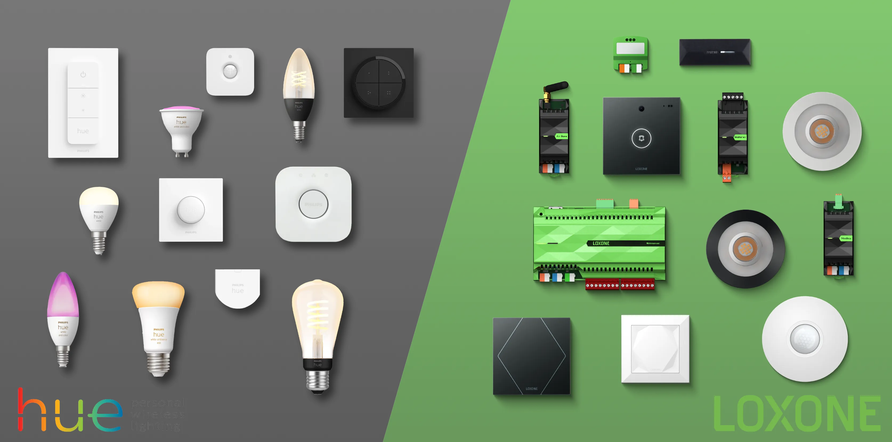

  

# loxone-hue-picoc
A PicoC script to control Philips Hue lights from a Loxone Miniserver. Using this solution it is not necessary to rely on a thirdparty bridge to translate between the Miniserver and the Hue Bridge.

> [!NOTE]
> Unfortunately this PicoC code can only send commands to the Hue system. Is is however not possible to receive events from the Hue system. Have a look at the [repo hue-to-loxone](https://github.com/marcelschreiner/hue-to-loxone) if you also want to receive events from your Hue system.

# Getting Started
Follow these steps to get the PicoC script working:
- Generate a Philips hue API key. [This blog entry](https://www.sitebase.be/generate-phillips-hue-api-token/) describes how to do this.
- Enter the ip address and Hue API key in the PicoC script.
- Get a list of all the id's of the lights connected to your Hue bridge. Go to:
`https://<bridge-ip>/api/<api-key>/lights`. This will show a json file with all the id's.
- Enter all the id's and device types you want to control in the PicoC script.
- If you exceed the 13 devices limit, you can ether use Hue groups `https://<bridge-ip>/api/<api-key>/groups`, or you can run up to 8 PicoC scripts simultaneously on the Loxone Miniserver.
  

## License
Released under the [MIT License](LICENSE.md), this code is yours to command! 🚀 Modify it, tweak it, use it to your heart's content. Let's create something amazing together! 💻🌟

 

